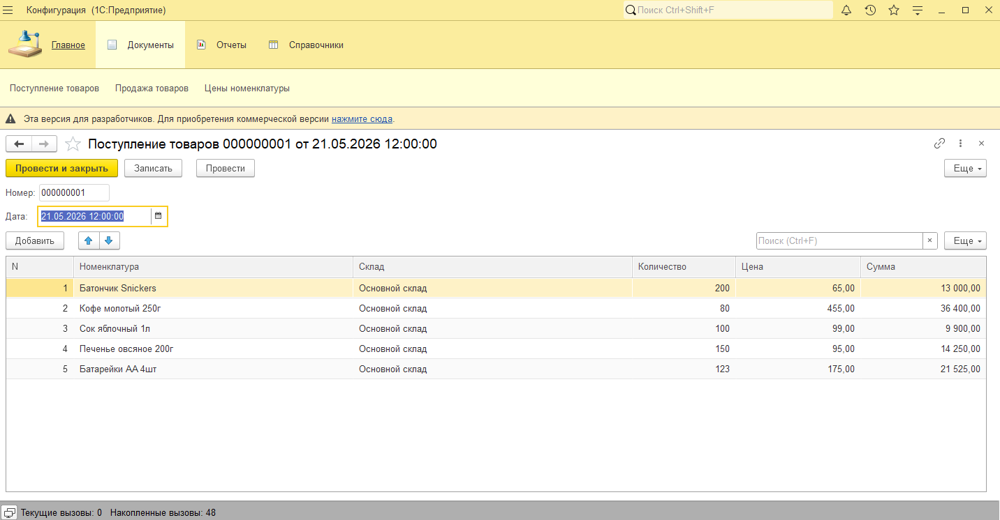
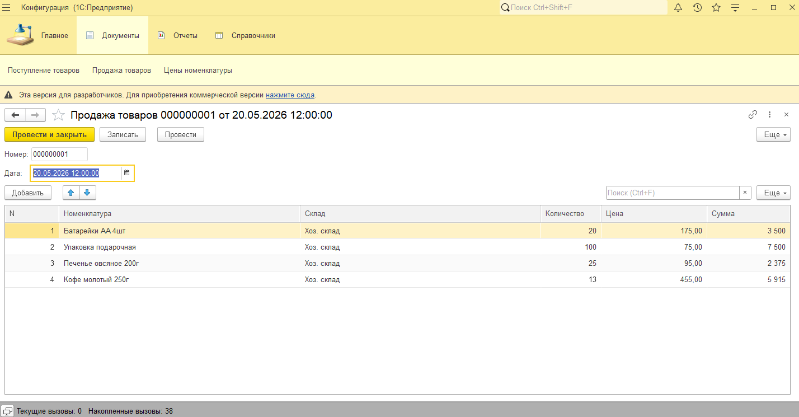
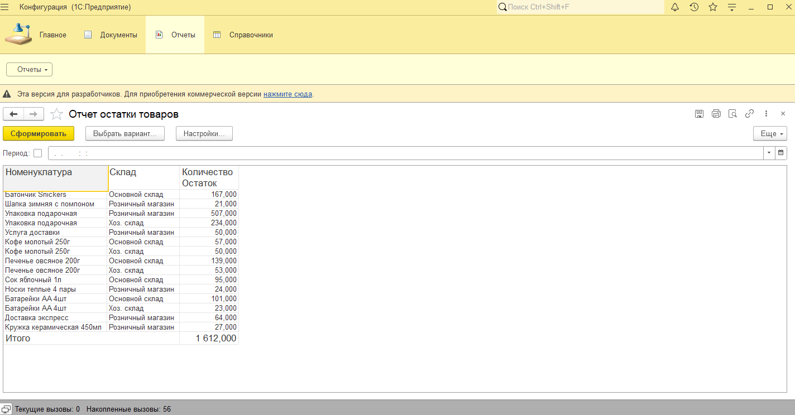

# Учёт товаров в 1С

Небольшая система учёта товаров на платформе **1С:Предприятие**, созданная как практический проект с основной бизнес-логикой: поступление, продажа, хранение цен, расчёт сумм и контроль остатков.

Проект находится в разработке и будет постепенно дополняться новыми возможностями.

## Что уже реализовано

- справочник **Номенклатура**
- справочник **Склады**
- справочник **ЕдиницыИзмерения**
- документ **ПоступлениеТоваров**
- документ **ПродажаТоваров**
- перечисление **ВидыНоменклатуры**
- регистр сведений **ЦеныНоменклатуры**
- регистр накопления **ОстаткиТоваров**
- отчёт **ОстаткиТоваров**
- автоматическое подставление цены в форме документа
- расчёт суммы в общем модуле

## Структура проекта

Проект построен вокруг базового складского учёта и включает:

- хранение данных о товарах, складах и единицах измерения;
- оформление документов поступления и продажи;
- учёт цен номенклатуры;
- движение товаров по остаткам;
- формирование отчёта по текущим остаткам.

## Скриншоты

### Поступление товаров

### Продажа товаров

### Отчёт по остаткам

## Статус

Проект учебный, но уже содержит рабочую основу для складского учёта и может быть расширен до более полноценной системы.

## Планы развития

- доработка интерфейса;
- расширение отчётности;
- добавление проверок и ограничений;
- улучшение пользовательского опыта;
- развитие логики документов и регистров.

## Технологии

- **1С:Предприятие**
- **Конфигуратор 1С**
- Git / GitHub

## Как запустить

1. Склонировать репозиторий.
2. Открыть конфигурацию в **1С:Предприятие**.
3. Выгрузить / загрузить конфигурацию из файлов.
4. Обновить базу в режиме предприятия.
